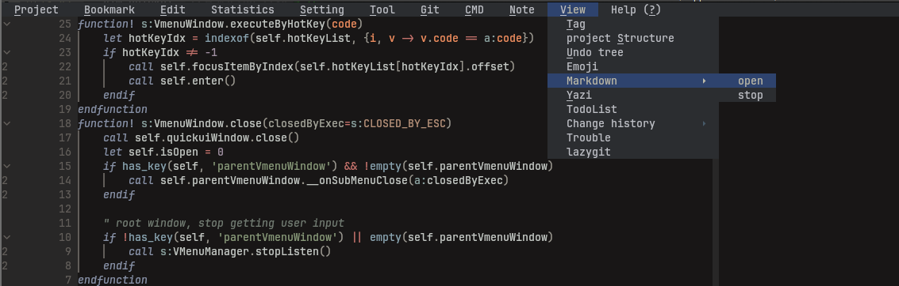
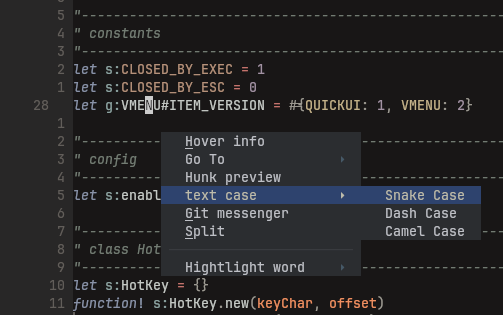

# vmenu
another menu plugin. made as replacement of menu and context menu of vim-quickui in personal use
case

## screenshot



## Why another plugin
just have some ideas want to try, start over seems easier and tempting

## Here is what I want it to be
### 0.2.0
* compatible with vim and neovim (by using old vimscript and unified popup window api of vim-quickui)
* easy to hack
* menu and context menu already exist in my config should work as well
* provide an enhanced context item (vmenu item) that you can control whether to show or active dynamically
* nice default looking (I ported one from IntelliJ IDEA since I'm not good at it)
### 0.3.0 NEXT
* mouse support
* better looking

### 0.4.0
* an always open top menu

## NOTE
* This plugin may changes radically, use with caution

## Install
packer.nvim
```vimscript
    use { "leo-fp/vmenu",
        requires = "skywind3000/vim-quickui"
    }

```
vim-plug
```vimscript
    Plug 'skywind3000/vim-quickui'
    Plug 'leo-fp/vmenu'
```

## comming from vim-quickui
context menu:
```vimscript
" replace this
call quickui#context#open(content, opts)
" to
call vmenu#openContextWindow(vmenu#parse_context(content), opts)

```
top menu:
```vimscript
" replace this
call quickui#menu#install
" to
call vmenu#installTopMenu
" then
call vmenu#openTopMenu()

```

## tips and tricks
* if you want append some vmenu items to your vim-quickui context menu
```vimscript
" example
let quickui_context = [
            \ ["name", '']
            \]
let content = vmenu#parse_context(quickui_context) + vmenu#parse_context([
            \#{name: 'name', cmd: ''},
            \], g:VMENU#ITEM_VERSION.VMENU)
call vmenu#openContextWindow(content, {})

```

* if you want append some vmenu items to your vim-quickui menu (top menu)
```vimscript
" example
call vmenu#installTopMenu('menu_name', [
            \ [ "vim-quickui item name", '', ""] ,
            \ ] +  vmenu#parse_context([
                \#{name: 'vmenu item name', cmd: ''},
                \], g:VMENU#ITEM_VERSION.VMENU)
            \)
```

* if you want define a vmenu item that behaves like pressing a key
```vimscript
let content = vmenu#parse_context([
            \#{name: 'copy relative path', cmd: 'norm Y'},
            \], g:VMENU#ITEM_VERSION.VMENU)
call vmenu#openContextWindow(content, {})

```
* if you want define a vmenu item that only appears in specific file type
```vimscript
let content = vmenu#parse_context([
            \#{name: 'copy relative path', cmd: 'norm Y', show-ft: ["NvimTree"]},
            \], g:VMENU#ITEM_VERSION.VMENU)
call vmenu#openContextWindow(content, {})

```
* if you want define a vmenu item that deactive in specific file type
```vimscript
let content = vmenu#parse_context([
            \#{name: 'copy relative path', cmd: 'norm Y', deactive-ft: ["NvimTree"]},
            \], g:VMENU#ITEM_VERSION.VMENU)
call vmenu#openContextWindow(content, {})

```

* if you want define a vmenu item that only appears in specific mode
```vimscript
call vmenu#openContextWindow(vmenu#parse_context([
            \#{name: 'visual mode only item', cmd: '', show-mode: ["v"]},
            \], g:VMENU#ITEM_VERSION.VMENU), #{curMode: 'v'})

```
* if you want a more flexible way to control vmenu item show status or deactive status, you can
define a function to `show-if` or `deactive-if` field. for more details, check `:h vmenu`

## changelog
* 0.2.0: first releases

## related projects
[vim-quickui](https://github.com/skywind3000/vim-quickui)
[which-key.nvim](https://github.com/folke/which-key.nvim)
[menu](https://github.com/nvzone/menu)

## known problem
* because I'm not using all features of menu and context menu, some features may missing
