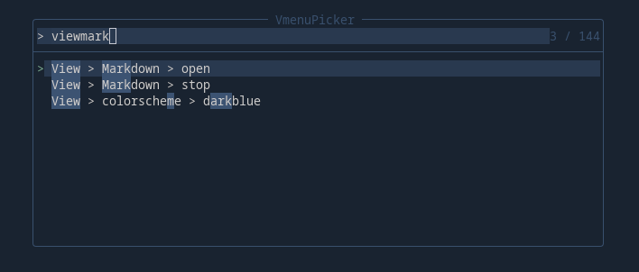

# vmenu
another menu plugin. made as replacement of menu and context menu of vim-quickui in personal use
case

## screenshot
note: These items in the picture are not provided in this plugin.


## Why another plugin
just have some ideas want to try, start over seems easier and tempting

## Here is what I want it to be
* compatible with vim and neovim (by using old vimscript and unified popup window api of vim-quickui)
* easy to hack
* not slow
* feature rich

### 0.2.0
* menu and context menu already exist in my config should work as well
* provide an enhanced context item (vmenu item) that you can control whether to show or active dynamically
* nice default looking (I ported one from IntelliJ IDEA since I'm not good at it)

---

### 0.3.0
#### features:
* mouse support (click, hover)
* new api "vmenu#cleanTopMenu"
* show a non-interactive scrollbar when items number exceeds 20
* new vmenu item "onFocus"
* expose name field to funcref type cmd
* cmd field can be defined as Funcref
* new vmenu item field "group"
* add a build-in function "vmenu#matchRegex" to work with show-if or deactive-if
* vim-quickui item and vmenu item can be mixed.
* add a build-in function(vmenu#existFileType) to work with show-if or deactive-if
* echo context item tips in command line by default. can be disabled by setting g:vmenu_enable_echo_tips=0

---

### 0.4.0 NEXT
- [ ] an always opening top menu
- [x] fuzzy picker suport

## NOTE
* This plugin may changes radically, use with caution

## Install
install these two plugins using your favorite package manager.
```
skywind3000/vim-quickui
leo-fp/vmenu
```
## comming from vim-quickui
context menu:
```vim
" replace this
call quickui#context#open(content, opts)
" to
call vmenu#openContextWindow(vmenu#parse_context(content), opts)

```
top menu:
```vim
" replace this
call quickui#menu#install
" to
call vmenu#installTopMenu
" then
call vmenu#openTopMenu()

```

## quick start for beginner
```vim
"-------------------------------------------------------------------------------
" top menu
"-------------------------------------------------------------------------------
call vmenu#installTopMenu('&File', vmenu#parse_context([
            \#{name: "&new\t", subItemList: [
            \   #{name: "window", cmd: "new"}
            \]}
            \], g:VMENU#ITEM_VERSION.VMENU))

call vmenu#installTopMenu('Help (&?)', vmenu#parse_context([
            \#{name: "vmenu", cmd: 'h vmenu.txt'}
            \], g:VMENU#ITEM_VERSION.VMENU))

" <leader> is backslash by default
nnoremap <silent> <leader><leader> :call vmenu#openTopMenu()<CR>

"-------------------------------------------------------------------------------
" context menu
"-------------------------------------------------------------------------------
let content = [
            \#{name: "Copy", cmd: 'norm gv"+y', show-mode: ["v"], icon:'󰆏'},
            \#{name: "paste", cmd: 'norm "+p', show-mode: ["n"]}
            \]
nnoremap <silent> <leader>q :call vmenu#openContextWindow(vmenu#parse_context(content, g:VMENU#ITEM_VERSION.VMENU), {})<CR>
vnoremap <silent> <leader>q :call vmenu#openContextWindow(vmenu#parse_context(content, g:VMENU#ITEM_VERSION.VMENU), #{curMode: "v"})<CR>

```

## tips and tricks
* vim-quickui item and vmenu item can be mixed like this
```vim
" context menu
let list = [
            \ ["vim-quickui item", ''],
            \ vmenu#parse_context([#{name: "vmenu item", cmd: ""}], g:VMENU#ITEM_VERSION.VMENU)[0]
            \]
call vmenu#openContextWindow(list, {})

" top menu
call vmenu#installTopMenu('menu_name', [
            \ [ "vim-quickui item name", '', ""] ,
            \ vmenu#parse_context([#{name: 'vmenu item name', cmd: ''}], g:VMENU#ITEM_VERSION.VMENU)[0]
            \])
```

* if you want define a vmenu item that behaves like pressing a key
```vim
let content = vmenu#parse_context([
            \#{name: 'copy relative path', cmd: 'norm Y'},
            \], g:VMENU#ITEM_VERSION.VMENU)
call vmenu#openContextWindow(content, {})

```
* if you want define a vmenu item that only appears in specific file type
```vim
let content = vmenu#parse_context([
            \#{name: 'copy relative path', cmd: 'norm Y', show-ft: ["NvimTree"]},
            \], g:VMENU#ITEM_VERSION.VMENU)
call vmenu#openContextWindow(content, {})

```
* if you want define a vmenu item that deactive in specific file type
```vim
let content = vmenu#parse_context([
            \#{name: 'copy relative path', cmd: 'norm Y', deactive-ft: ["NvimTree"]},
            \], g:VMENU#ITEM_VERSION.VMENU)
call vmenu#openContextWindow(content, {})

```

* if you want define a vmenu item that only appears in specific mode
```vim
call vmenu#openContextWindow(vmenu#parse_context([
            \#{name: 'visual mode only item', cmd: '', show-mode: ["v"]},
            \], g:VMENU#ITEM_VERSION.VMENU), #{curMode: 'v'})

```

* preview installed colorscheme (kind of lame, but it works)

```vim
call vmenu#openContextWindow(vmenu#parse_context([
            \#{name: "preview colorscheme\t", subItemList:
            \ map(getcompletion('', 'color'),
            \  { idx, val
            \  -> #{
            \       name: val,
            \       tip: "current colorscheme: " .. val,
            \       onFocus: { -> execute("colorscheme " .. val) }
            \      }
            \  })
            \},
            \], g:VMENU#ITEM_VERSION.VMENU), #{})
```


* fuzzy picker support

telescope.nvim



```lua
local pickers = require "telescope.pickers"
local finders = require "telescope.finders"
local conf = require("telescope.config").values
local actions = require "telescope.actions"
local action_state = require "telescope.actions.state"

local VmenuPicker = function(opts)
    opts = opts or {}
    pickers.new(opts, {
        prompt_title = "VmenuPicker",
        finder = finders.new_table {
            results = vim.fn['vmenu#queryItems']({}),

            entry_maker = function(entry)
                return {
                    value = entry,
                    display = entry.path,
                    ordinal = entry.path,
                }
            end
        },
        sorter = conf.generic_sorter(opts),
        attach_mappings = function(prompt_bufnr, map)
            actions.select_default:replace(function()
                actions.close(prompt_bufnr)
                local selection = action_state.get_selected_entry()
                --print(vim.inspect(selection))
                vim.fn['vmenu#executeItemById'](selection.value.id)
            end)
            return true
        end,
    }):find()
end

-- to execute the function
VmenuPicker(require("telescope.themes").get_dropdown{})
```

* If you want to auto-complete most of a command.

```vim
let content = vmenu#parse_context([
            \#{name: 'save to somewhere', cmd: { -> feedkeys(':saveas ~/somewhere/') } },
            \], g:VMENU#ITEM_VERSION.VMENU)
call vmenu#openContextWindow(content, {})
```

* enable mouse hover

```vim
    :set mousemoveevent
    :let g:vmenu_enable_mouse_hover = 1
```

* if you want a more flexible way to control vmenu item show status or deactive status, you can
define a function to `show-if` or `deactive-if` field. for more details, check `:h vmenu`

## similar plugins
[vim-quickui](https://github.com/skywind3000/vim-quickui)

[which-key.nvim](https://github.com/folke/which-key.nvim)

[menu](https://github.com/nvzone/menu)

## inspired by
[vim-quickui](https://github.com/skywind3000/vim-quickui)

[IntelliJ IDEA - JetBrains](https://www.jetbrains.com/idea/)

[which-key.nvim](https://github.com/folke/which-key.nvim)

[nui.nvim](https://github.com/MunifTanjim/nui.nvim)

[menu](https://github.com/nvzone/menu)

[dropbar.nvim](https://github.com/Bekaboo/dropbar.nvim)

## known problem
* because I'm not using all features of menu and context menu, some features may missing
